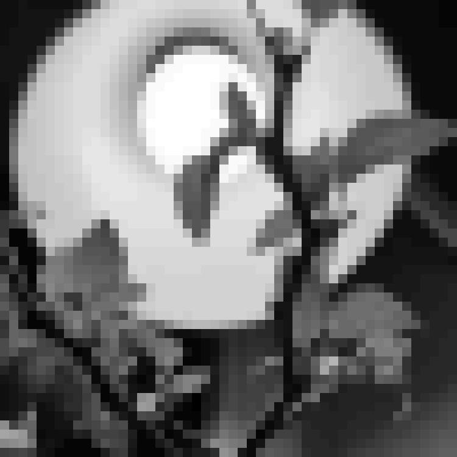

# AT-07_grey_pixel_art
26.11.2021 
Код исправлен. Добавлена возможность 
<ul>
  <li>выбора исходного изображения</li> 
  <li>изменения размера мозаики</li>
  <li>изменения градации серого</li>
</ul>
##Пример работы кода.
Исходное изображение:

 Результат (при размере мозаики 15x15 и градации серого 5):

