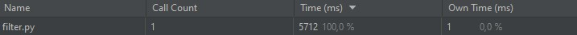
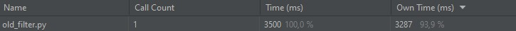

# AT-07_grey_pixel_art
26.11.2021 

 Разница во времени настолько большая, поскольку в первом случае мы вручную вводим данные, а во втором случае данные вводятся автоматически. 

Программа выполняется быстро за счет автоматического ввода данных и матричных преобразований, которыми мы заменили ручные циклы.
<h2>Исходное изображение</h2>

<h2>Результат выполнения изначальной программы (old_filter.py)</h2>

<h2>Результат выполнения программы filter.py</h2>

<h2>Результат выполнения программы filter_with_filename.py</h2>

